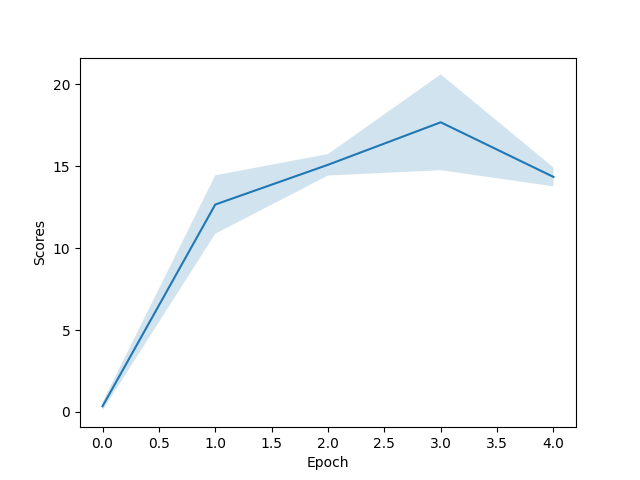

# RL with MinAtar - Assignment 2 of cs234 2023

## Intorduction
In this assignment, a modified version of deep Q-learning from DeepMind’s paper is implemented. For the environment setting, the player controls a bar that can move horizontally, and gets rewards by bouncing a ball into bricks, breaking them. We are going to use MinAtar ([7]), a miniaturized version of the original Atari game. Instead of the original 210 × 160 RGB image resolution, MinAtar uses a 10 × 10 boolean grid, which makes it possible to use a significantly smaller model and still get a good performance.

## Experiment and results
### Linear approaxiamtion
The $Q$ values is represented as a parametric function $Q_w(s, a)$ where $w$ is the weights and biases of a linear function. The code parts are q4_linear_torch.py and q6_train_atari_linear.py.
### Neural network approaximation, DeepMind's DQN
The $Q$ values is represented as a parametric function $Q_w(s, a)$ where $w$ is the weights and biases of smaller version of the deep Q-network, listed as following. 
* One convolution layer with 16 output channels, a kernel size of 3, stride 1, and no padding. 
* A ReLU activation.
* A dense layer with 128 hidden units.
* Another ReLU activation.
* The final output layer.
The code parts are q5_nature_torch.py and q6_train_atari_nature.py.
### Results

